# MLOps Churn Prediction Platform

Production-grade MLOps system for customer churn prediction using FastAPI, MLflow, PostgreSQL, Redis, Celery, Prometheus, Grafana, Loki, Fluent-bit, Garage (S3-compatible storage), and Nginx. The system supports model training, experiment tracking, model registry, real-time inference, asynchronous retraining, full observability, and containerized deployment.

---

# Architecture



---

# Features

* End-to-end machine learning pipeline for churn prediction
* Feature engineering and preprocessing with one-hot encoding
* Missing value handling and data splitting (80/20 stratified)
* Random Forest classifier with hyperparameter optimization
* Hyperparameter tuning using Optuna with TPE Sampler (15 trials, 5-fold cross-validation)
* Optimization metric: ROC-AUC maximization
* Experiment tracking with parameters, metrics, and artifacts
* Model registry with versioning and stage management
* Automatic model promotion to Production stage after training
* FastAPI inference service with Swagger documentation
* Root path configuration for reverse proxy sub-path deployment
* Model loading from MLflow registry at API startup
* Prediction endpoint returning class (0/1) and probability
* Prometheus metrics exposure (prediction request counter, process metrics)
* Asynchronous model retraining via Celery task queue
* Celery worker executing full training pipeline on demand
* PostgreSQL backend for MLflow metadata storage
* S3-compatible artifact storage using Garage
* Automatic Garage initialization (layout, keys, bucket, permissions)
* Environment-based credential injection for S3 access
* Structured JSON logging with service-level metadata
* Log collection via Fluent-bit HTTP input
* Log storage and querying in Loki
* Prometheus metrics scraping from API service
* Grafana dashboards with Prometheus and Loki data sources
* Nginx reverse proxy with path-based routing
* Sub-path configuration for Prometheus and Grafana
* Health checks with automatic container restart
* Persistent volumes for PostgreSQL, Garage, Grafana, Loki, Fluent-bit
* Multi-stage Dockerfile with caching and registry mirror support
* Full containerization with Docker Compose and Podman Compose

---

# Services

| Service      | Description                                           | Internal Port | External Access via Nginx |
| ------------ | ----------------------------------------------------- | ------------- | ------------------------- |
| Nginx        | Reverse proxy and path-based routing                  | 80            | Port 8080 (all routes)    |
| API          | FastAPI inference service                             | 8000          | /api/*                    |
| MLflow       | Experiment tracking and model registry UI             | 5000          | /mlflow/*                 |
| Prometheus   | Metrics collection and query interface                | 9090          | /prometheus/*             |
| Grafana      | Visualization and dashboards                          | 3000          | /grafana/*                |
| Loki         | Log aggregation and query API                         | 3100          | Internal (via Grafana)    |
| Fluent-bit   | Log collection and forwarding to Loki                 | 2020          | Internal                  |
| Redis        | Message broker for Celery task queue                  | 6379          | Internal                  |
| PostgreSQL   | MLflow metadata store                                 | 5432          | Internal                  |
| Garage       | S3-compatible artifact storage                        | 3900-3903     | Internal                  |
| Worker       | Celery worker for asynchronous retraining             | -             | Internal                  |
| Trainer      | One-shot model training service                       | -             | Internal                  |
| Garage-setup | One-time Garage initialization (layout, keys, bucket) | -             | Internal                  |

---

# Setup

## 1. Clone repository

```bash
git clone https://hamgit.ir/mr.amirhosseinmaleki/mlops-platform
cd mlops-platform
```

## 2. Configure environment

```bash
cp .env.example .env
```

Edit `.env`:

```env
POSTGRES_DB=mlops
POSTGRES_USER=admin
POSTGRES_PASSWORD=admin

MLFLOW_S3_ENDPOINT_URL=http://garage:3900
AWS_ACCESS_KEY_ID=admin
AWS_SECRET_ACCESS_KEY=password

MLFLOW_TRACKING_URI=http://mlflow:5000
REDIS_URL=redis://redis:6379/0

GRAFANA_ADMIN_PASSWORD=admin

DOCKER_REGISTRY=docker.arvancloud.ir
PIP_INDEX_URL=https://pypi.devneeds.ir/simple/
PIP_TRUSTED_HOST=pypi.devneeds.ir
```

## 3. Start system

### Docker Compose

```bash
docker compose up --build -d
```

### Podman Compose

```bash
podman-compose --env-file .env up -d --build
```

## 4. Initialize Garage storage

The Garage setup runs automatically on first start. If manual initialization is needed:

```bash
podman-compose run --rm garage-setup
```

This script performs:
- Waits for Garage RPC and Admin API to be ready
- Fetches the Garage node ID
- Assigns storage layout (zone1, capacity 1)
- Applies the layout configuration
- Creates an admin API key (or reuses existing)
- Creates the `mlflow` S3 bucket (if not exists)
- Grants read, write, and owner permissions to the admin key
- Updates the `.env` file with generated credentials

## 5. Verify installation

```bash
# Check all services are running
docker compose ps

# Check API health
curl http://localhost:8080/api/health

# Access Swagger documentation
# Open: http://localhost:8080/api/docs
```

---

# API Usage

### Base URL

All API endpoints are accessible via Nginx at: `http://localhost:8080`

### Endpoints

| Method | Path              | Description                                      |
| ------ | ----------------- | ------------------------------------------------ |
| GET    | /api/health       | Health check and model load status               |
| GET    | /api/metrics      | Prometheus metrics (prediction counter, process) |
| POST   | /api/predict      | Churn prediction with probability                |
| GET    | /api/docs         | Swagger UI interactive documentation             |
| GET    | /api/openapi.json | OpenAPI schema definition                        |

### Examples

#### Health Check

```bash
curl http://localhost:8080/api/health
```

Response (model loaded):
```json
{"status": "ok"}
```

Response (model not loaded):
```json
{"status": "model not loaded — run trainer first"}
```

#### Prediction

```bash
curl -X POST http://localhost:8080/api/predict \
  -H "Content-Type: application/json" \
  -d '{
    "gender": "Male",
    "SeniorCitizen": 0,
    "Partner": "No",
    "Dependents": "No",
    "tenure": 1,
    "PhoneService": "Yes",
    "MultipleLines": "No",
    "InternetService": "DSL",
    "OnlineSecurity": "No",
    "OnlineBackup": "Yes",
    "DeviceProtection": "No",
    "TechSupport": "No",
    "StreamingTV": "No",
    "StreamingMovies": "No",
    "Contract": "Month-to-month",
    "PaperlessBilling": "Yes",
    "PaymentMethod": "Electronic check",
    "MonthlyCharges": 29.85,
    "TotalCharges": 29.85
  }'
```

Response:
```json
{
  "prediction": 0,
  "probability": 0.15
}
```

#### Metrics

```bash
curl http://localhost:8080/api/metrics
```

Key metrics exposed:
- `prediction_requests_total`: Counter of total prediction requests
- `python_gc_objects_collected_total`: Garbage collection statistics
- `process_virtual_memory_bytes`: Virtual memory usage
- `process_resident_memory_bytes`: Resident memory usage
- `process_cpu_seconds_total`: CPU time consumed
- `process_open_fds`: Number of open file descriptors

---

# Retraining

## Trigger manual retraining

```bash
docker exec -it mlops-platform_worker_1 \
python -c "from worker.celery_app import retrain; retrain.delay()"
```

For Podman:

```bash
podman exec mlops-platform_worker_1 \
python -c "from worker.celery_app import retrain; retrain.delay()"
```

## Retraining pipeline

The Celery worker executes the complete training pipeline:

1. Load data from `data/churn.csv`
2. Preprocess features (one-hot encoding, missing value handling)
3. Split data (80% training, 20% test, stratified)
4. Optimize hyperparameters with Optuna (15 trials, 5-fold CV)
5. Train final Random Forest model with best parameters
6. Evaluate metrics (accuracy, precision, recall, F1, AUC)
7. Log parameters, metrics, and artifacts to MLflow
8. Register model in MLflow registry
9. Promote new model version to Production stage

## Requirements

* Redis must be running and healthy
* Celery worker must be active
* Training data must be available in `./data/churn.csv`
* PostgreSQL must be accessible for MLflow metadata
* Garage must be accessible for artifact storage

## Scheduling

Retraining can be automated using Celery Beat. Add a periodic task schedule to trigger retraining at defined intervals.

---

# MLflow

## Access

* UI: `http://localhost:8080/mlflow`
* Backend Store: PostgreSQL (metadata: parameters, metrics, tags, run info)
* Artifact Store: Garage S3-compatible (models, plots, serialized objects)

## Experiment Tracking

Each training run logs:
- **Parameters**: n_estimators, max_depth, min_samples_split
- **Metrics**: accuracy, precision, recall, f1_score, roc_auc
- **Artifacts**: trained model (sklearn format), columns.pkl (feature names)
- **Tags**: run timestamp, model type, training dataset info

## Model Registry

- **Model Name**: `churn_model`
- **Stage**: `Production` (automatically promoted after training)
- **Versioning**: Each training run creates a new version
- **Stage Transitions**: None → Production (automated on training success)

---

# Monitoring

## Prometheus

### Access

- **URL**: `http://localhost:8080/prometheus`
- **Configuration File**: `infra/prometheus.yml`
- **Scrape Interval**: 15 seconds

### Scrape Targets

| Target | Endpoint            | Description           |
| ------ | ------------------- | --------------------- |
| API    | api:8000/metrics    | Application metrics   |
| MLflow | mlflow:5000/metrics | MLflow server metrics |

### Key Metrics

- `prediction_requests_total`: Total prediction requests served
- `process_*`: Process-level metrics (memory, CPU, file descriptors)
- `python_gc_*`: Python garbage collection statistics

## Grafana

### Access

- **URL**: `http://localhost:8080/grafana`
- **Default Credentials**: admin / admin (configurable via `.env`)

### Data Sources

| Data Source | URL                                 | Access |
| ----------- | ----------------------------------- | ------ |
| Prometheus  | `http://prometheus:9090/prometheus` | Server |
| Loki        | `http://loki:3100`                  | Server |

### Setup

1. Login to Grafana at `http://localhost:8080/grafana`
2. Data sources are pre-configured (Prometheus and Loki)
3. Import dashboards or create custom panels using Prometheus queries
4. Query application logs in Explore view using LogQL

## Loki

### Access

- **API**: `http://loki:3100` (internal)
- **Configuration**: `infra/loki-config.yml`

### Log Collection

- Fluent-bit collects structured JSON logs from all services
- Logs are forwarded to Loki via HTTP
- Each log entry contains: timestamp, level, service name, message

### Query Examples

```logql
{job="fluent-bit"} | json | service = "api"
{job="fluent-bit"} | json | service = "trainer"
{job="fluent-bit"} | json | level = "error"
```

## Fluent-bit

### Configuration

- **Main Config**: `infra/fluent-bit/fluent-bit.conf`
- **Parsers**: `infra/fluent-bit/parsers.conf`

### Pipeline

- Input: HTTP listener on port 8888 (receives JSON logs)
- Filter: JSON parser with reserved data
- Output: Loki on port 3100 with label `job=fluent-bit`

---

# Logging

## Format

All services use structured JSON logging with the following fields:

```json
{
  "timestamp": "2026-05-01T07:39:39.314209Z",
  "level": "INFO",
  "service": "api",
  "message": "Request processed",
  "method": "POST",
  "path": "/api/predict",
  "status_code": 200,
  "duration_ms": 45.23
}
```

## Services

- **API**: Logs model loading, requests, errors
- **Trainer**: Logs training pipeline steps, metrics, model registration
- **Worker**: Logs task execution, retraining status, errors

## Implementation

- Python module: `shared/logging.py`
- Library: `python-json-logger`
- Handler: StreamHandler with JSON formatter
- Each service injects its name via LoggerAdapter

---

# Deployment Notes

## Data Persistence

| Volume             | Purpose                         | Mount Point              |
| ------------------ | ------------------------------- | ------------------------ |
| pgdata             | PostgreSQL database files       | /var/lib/postgresql/data |
| garage_data        | S3-compatible object storage    | /var/lib/garage          |
| grafana_data       | Grafana dashboards and config   | /var/lib/grafana         |
| loki_data          | Aggregated log storage          | /loki                    |
| fluent-bit-storage | Log buffering before forwarding | /tmp/flb-storage         |

## Scaling

* API service: Horizontally scalable (add replicas behind Nginx)
* Celery workers: Increase worker count for parallel retraining
* Garage: Multi-node replication for high availability
* Prometheus: Federation for large-scale deployments
* Loki: Microservices mode for high log volume


