# MLOps Platform for Customer Churn Prediction

## Table of Contents

1. [Introduction](#introduction)
2. [System Overview](#system-overview)
3. [Architecture](#architecture)
4. [Installation and Deployment](#installation-and-deployment)
5. [Configuration](#configuration)
6. [API Reference](#api-reference)
7. [Using the Platform](#using-the-platform)
8. [Monitoring and Observability](#monitoring-and-observability)
9.  [Testing](#testing)
10. [Development Guide](#development-guide)

---

## Introduction

The MLOps Platform is a production‑grade system for customer churn prediction. It provides a complete machine learning operations lifecycle: data preprocessing, model training with hyperparameter optimization, experiment tracking, model versioning, real‑time and batch inference, asynchronous retraining, automatic data drift detection, feature caching, and full observability (metrics, logs, dashboards).

Designed to run on a single server with Docker Compose, it eliminates the complexity of Kubernetes‑based alternatives while delivering enterprise‑grade capabilities. All components are containerized and can be deployed in under 30 minutes.

---

## System Overview

### Core Capabilities

| Capability                    | Description                                                                                                 |
| ----------------------------- | ----------------------------------------------------------------------------------------------------------- |
| **Data Preprocessing**        | One‑hot encoding, missing value handling, train/test split (80/20 stratified).                              |
| **Model Training**            | Random Forest classifier with Optuna hyperparameter optimisation (15 trials, 5‑fold CV).                    |
| **Experiment Tracking**       | Full MLflow integration: parameters, metrics, artifacts (model, columns, feature importance).               |
| **Model Registry**            | Versioned models with `None`, `Staging`, `Production`, `Archived` stages.                                   |
| **Real‑time Inference**       | Single prediction endpoint with sub‑500 ms latency.                                                         |
| **Batch Inference**           | Asynchronous batch prediction (up to 10,000 records) via Celery.                                            |
| **Feature Cache**             | Redis‑based cache with MD5 hashing, pickle serialisation, and model version awareness.                      |
| **Retrain Queue**             | Automatic logging of every prediction to a Redis queue for incremental learning.                            |
| **Feedback Collection**       | Endpoints to submit actual labels for past predictions or directly add labelled training data.              |
| **Automatic Drift Detection** | Periodic (hourly) computation of data drift using Evidently, based on real production data from Redis.      |
| **Model Comparison**          | Pre‑deployment comparison of AUC, accuracy, and F1 metrics; promotion only if new model is better or equal. |
| **Cache Invalidation**        | Automatic clearing of old model cache upon promotion.                                                       |

### Security and Rate Limiting

- API key authentication with three roles: `admin`, `user`, `readonly`.
- Role‑based rate limiting (sliding window algorithm, Redis‑backed).
- All secrets externalized via `.env` file.

### Observability

- **Metrics**: Prometheus endpoint with custom metrics (request rate, latency, cache hit rate, drift status, queue length).
- **Logging**: Structured JSON logs sent asynchronously to Fluent‑bit, then to Loki.
- **Dashboards**: Four pre‑configured Grafana dashboards (API Performance, Model Performance, System Health, Log Explorer).
- **Health checks**: Service health endpoints with dependency verification.

### Deployment

- Fully containerized with Docker Compose / Podman Compose.
- Nginx reverse proxy for unified access: `/api/*`, `/mlflow/*`, `/prometheus/*`, `/grafana/*`.
- Single command deployment: `make up`.

---

## Architecture

The platform consists of the following layers:

#### 1. Data Ingestion & Retrain Queue Layer

This layer handles all data input sources including initial CSV training data, historical labeled data, and user feedback. All incoming labeled data is stored in Redis retrain queue for future model retraining.



**Key Components:**
- `POST /collect-training-data` - Direct ingestion of labeled historical data
- `POST /feedback/{prediction_id}` - User feedback for past predictions
- Redis Retrain Queue (`retrain:training_data`) - Persistent queue for accumulating training data

---

#### 2. Training & Model Registry Layer

This layer contains the complete training pipeline including hyperparameter optimization with Optuna, Random Forest training, metric evaluation, and automatic model comparison against the current production model. The MLflow Model Registry manages model versions and stores artifacts in Garage S3.



**Key Components:**
- Optuna Search - 15 trials with 5-fold cross validation
- Random Forest Training - With optimized hyperparameters
- Model Comparison - AUC, Accuracy, F1 comparison before promotion
- MLflow Server - Model registry and experiment tracking
- PostgreSQL - Metadata storage for runs, parameters, metrics
- Garage S3 - Artifact storage for model.pkl and columns.pkl
- Feature Cache - Model-version-aware cache invalidation on promotion

---

#### 3. Inference Serving Layer

This layer provides real-time and batch prediction capabilities. The FastAPI service handles authentication, rate limiting, feature caching, and model loading. All predictions are automatically logged to the retrain queue for future model improvements.



**Key Components:**
- Nginx Reverse Proxy - Path-based routing on port 8080
- FastAPI - Main inference service on port 8000
- API Key Authentication - Three roles (admin, user, readonly)
- Rate Limiter - Sliding window algorithm with Redis
- Feature Cache - Lookup with key `features:{hash}:v{model_version}`
- FeatureStore.prepare() - One-hot encoding and column alignment
- Production Model Loading - From MLflow registry

---

#### 4. Async Processing & Observability Layer

This layer manages all asynchronous tasks including batch predictions, model retraining, automatic drift detection, and queue cleanup. The observability stack provides metrics, logs, and dashboards for monitoring system health and model performance.



**Key Components:**
- Celery Beat - Scheduled task trigger (hourly drift, daily expiry)
- Celery Worker - Executes async tasks
- batch_predict - Asynchronous batch predictions
- retrain - Full training pipeline execution
- periodic_drift_check - Hourly drift detection using Evidently
- expire_old_pending - Cleanup of records older than 30 days
- Prometheus - Metrics collection and querying on port 9090
- Loki - Log aggregation and storage on port 3100
- Grafana - Dashboards on port 3000 (API Performance, Model Performance, System Health, Log Explorer)
- Fluent-bit - Log collection and forwarding on port 8888

---

### Data Flow for a Single Prediction

1. Client → Nginx → FastAPI.
2. Authentication and rate limiting.
3. Feature cache lookup in Redis (key: `features:{md5_hash}:v{model_version}`).
4. On cache miss: feature preprocessing (`FeatureStore.prepare`), then store in Redis.
5. Model prediction using production model loaded from MLflow.
6. Prediction logged to Redis retrain queue (`retrain:training_data`).
7. Prediction statistics updated in Redis.
8. Response returned to client.

### Automatic Drift Detection Flow

1. Celery Beat triggers `periodic_drift_check` every hour.
2. Task reads recent predictions (last 24 hours) from Redis retrain queue.
3. If sufficient samples (≥100), Evidently compares current data with reference data (from `churn.csv`).
4. Results (`dataset_drift`, drifted columns) logged to MLflow and Prometheus.
5. Warning log sent to Loki if drift detected.

### Retraining Flow

1. Manual trigger via `POST /api/retrain` or automatic after drift (optional).
2. Celery task `retrain` loads labelled data from Redis retrain queue (fallback to CSV).
3. Hyperparameter search with Optuna, model training, evaluation.
4. New model registered in MLflow.
5. Metrics compared with current production model.
6. If better or equal, model promoted to `Production` and old cache cleared.
7. Retrain queue cleared.

---

## Installation and Deployment

### 1. Clone the Repository

```bash
git clone git@hamgit.ir:mr.amirhosseinmaleki/mlops-platform.git
cd mlops-platform
```

### 2. Configure Environment

Copy the example environment file and edit it:

```bash
cp .env.example .env
nano .env
```

At minimum, review and set:
- API keys (`API_KEY_ADMIN`, `API_KEY_USER`, `API_KEY_READONLY`).
- Database passwords (`POSTGRES_PASSWORD`).
- Grafana admin password (`GRAFANA_ADMIN_PASSWORD`).
- Registry URLs if behind a firewall (`DOCKER_REGISTRY`, `PIP_INDEX_URL`, `PIP_TRUSTED_HOST`).

### 3. Build and Start the Platform

```bash
make build-base   # Build the base Docker image
make up           # Start all services
```

The first startup will:
- Initialize PostgreSQL, Redis, and Garage.
- Run the initial model training from `data/churn.csv`.
- Start API, worker, Prometheus, Loki, Fluent‑bit, Grafana, and Nginx.

### 4. Verify Deployment

```bash
make ps                     # Show container status
curl http://localhost:8080/health   # Should return {"status":"healthy"}
```

### 5. Access the Services

| Service                     | URL                              | Authentication                      |
| --------------------------- | -------------------------------- | ----------------------------------- |
| API Documentation (Swagger) | http://localhost:8080/api/docs   | API key (via `Authorize` button)    |
| MLflow UI                   | http://localhost:8080/mlflow     | None                                |
| Grafana                     | http://localhost:8080/grafana    | admin / `${GRAFANA_ADMIN_PASSWORD}` |
| Prometheus                  | http://localhost:8080/prometheus | None                                |

### 6. Shutdown

```bash
make down      # Stop all containers (preserves volumes)
make down-v    # Stop and remove all volumes (deletes all data)
```

---

## Configuration

All configuration is done through the `.env` file. Below are the most important variables.

### Authentication

| Variable           | Default                                    | Description                 |
| ------------------ | ------------------------------------------ | --------------------------- |
| `API_KEY_ADMIN`    | `admin-secret-key-change-in-production`    | Admin API key (full access) |
| `API_KEY_USER`     | `user-secret-key-change-in-production`     | User API key (read/write)   |
| `API_KEY_READONLY` | `readonly-secret-key-change-in-production` | Read‑only API key           |

### Rate Limiting

| Variable               | Default | Description                             |
| ---------------------- | ------- | --------------------------------------- |
| `RATE_LIMIT_ENABLED`   | `true`  | Enable/disable rate limiting            |
| `RATE_LIMIT_ADMIN`     | `1000`  | Requests per minute for admin           |
| `RATE_LIMIT_USER`      | `100`   | Requests per minute for user            |
| `RATE_LIMIT_READONLY`  | `50`    | Requests per minute for readonly        |
| `RATE_LIMIT_ANONYMOUS` | `10`    | Requests per minute for unauthenticated |
| `RATE_LIMIT_WINDOW`    | `60`    | Window size in seconds                  |

### Database

| Variable            | Default    | Description                 |
| ------------------- | ---------- | --------------------------- |
| `POSTGRES_DB`       | `mlops`    | Database name               |
| `POSTGRES_USER`     | `admin`    | Database user               |
| `POSTGRES_PASSWORD` | `admin`    | Database password           |
| `POSTGRES_HOST`     | `postgres` | PostgreSQL service hostname |
| `POSTGRES_PORT`     | `5432`     | PostgreSQL port             |

### Redis

| Variable               | Default                | Description                             |
| ---------------------- | ---------------------- | --------------------------------------- |
| `REDIS_URL`            | `redis://redis:6379/0` | Redis connection URL                    |
| `REDIS_EXPIRE_SECONDS` | `86400`                | Expiry for batch results (seconds)      |
| `REDIS_EXPIRE_DAYS`    | `30`                   | Expiry for pending queue records (days) |

### MLflow and Model

| Variable                 | Default              | Description                          |
| ------------------------ | -------------------- | ------------------------------------ |
| `MLFLOW_TRACKING_URI`    | `http://mlflow:5000` | MLflow tracking server               |
| `MLFLOW_S3_ENDPOINT_URL` | `http://garage:3900` | S3‑compatible endpoint for artifacts |
| `MODEL_NAME`             | `churn_model`        | Registered model name                |
| `EXPERIMENT_NAME`        | `customer_churn`     | MLflow experiment name               |
| `DATA_PATH`              | `data/churn.csv`     | Path to initial training data        |

### Feature Cache

| Variable            | Default | Description                             |
| ------------------- | ------- | --------------------------------------- |
| `CACHE_TTL_SECONDS` | `3600`  | Feature cache TTL (seconds)             |
| `MAX_BATCH_RECORDS` | `10000` | Maximum batch size for batch prediction |

### Logging

| Variable         | Default                  | Description                                 |
| ---------------- | ------------------------ | ------------------------------------------- |
| `FLUENT_BIT_URL` | `http://fluent-bit:8888` | Fluent‑bit HTTP endpoint                    |
| `LOG_LEVEL`      | `INFO`                   | Logging level (DEBUG, INFO, WARNING, ERROR) |

---

## API Reference

### Authentication Header

All protected endpoints require:
```
X-API-Key: admin-secret-key-change-in-production
```

### Endpoint Summary

| Method               | Endpoint                                                  | Permission | Description                                  |
| -------------------- | --------------------------------------------------------- | ---------- | -------------------------------------------- |
| **Predictions**      |                                                           |            |                                              |
| POST                 | `/api/predictions/single`                                 | read       | Single real‑time prediction                  |
| POST                 | `/api/predictions/batch`                                  | write      | Async batch prediction                       |
| GET                  | `/api/predictions/batch/{batch_id}/status`                | read       | Batch job status                             |
| GET                  | `/api/predictions/batch/{batch_id}/results`               | read       | Batch results                                |
| **Feedback**         |                                                           |            |                                              |
| POST                 | `/api/feedback/{prediction_id}`                           | write      | Submit actual label for a past prediction    |
| POST                 | `/api/predictions/collect-training-data?actual_churn=0/1` | write      | Directly add labelled training data          |
| **Model Management** |                                                           |            |                                              |
| GET                  | `/api/models/current`                                     | read       | Get production and staging models            |
| GET                  | `/api/models/{model_name}`                                | read       | Get model details                            |
| GET                  | `/api/models/{model_name}/versions`                       | read       | List all versions                            |
| POST                 | `/api/models/deploy`                                      | admin      | Promote model to Staging/Production          |
| GET                  | `/api/models/health/model-version`                        | read       | Get current production version               |
| **Retraining**       |                                                           |            |                                              |
| POST                 | `/api/retrain`                                            | retrain    | Trigger async retraining                     |
| GET                  | `/api/retrain/{task_id}/status`                           | read       | Get retraining task status                   |
| GET                  | `/api/retrain-queue/status`                               | -          | Get number of pending records                |
| **Drift Detection**  |                                                           |            |                                              |
| POST                 | `/api/monitoring/drift/check`                             | read       | Manual drift check on provided data          |
| POST                 | `/api/monitoring/drift/auto-check`                        | read       | Trigger auto drift check from Redis          |
| GET                  | `/api/monitoring/drift/status`                            | read       | Recent drift check results                   |
| **Batch Jobs**       |                                                           |            |                                              |
| GET                  | `/api/batch/jobs`                                         | read       | List recent batch jobs                       |
| GET                  | `/api/batch/{batch_id}/summary`                           | read       | Summary statistics of a batch                |
| DELETE               | `/api/batch/{batch_id}`                                   | write      | Delete batch job                             |
| **Monitoring**       |                                                           |            |                                              |
| GET                  | `/api/monitoring/metrics/prometheus`                      | -          | Prometheus metrics endpoint                  |
| GET                  | `/api/monitoring/metrics`                                 | -          | API metrics summary                          |
| GET                  | `/api/monitoring/health/system`                           | -          | System health (CPU, RAM, disk, dependencies) |
| GET                  | `/api/monitoring/prediction-stats`                        | read       | Real‑time prediction statistics              |
| DELETE               | `/api/monitoring/cache`                                   | admin      | Clear feature cache                          |
| **Health**           |                                                           |            |                                              |
| GET                  | `/health`                                                 | -          | Quick health check                           |
| GET                  | `/`                                                       | -          | API information                              |

### Detailed Examples

#### Single Prediction

```bash
curl -X POST http://localhost:8080/api/predictions/single \
  -H "X-API-Key: user-secret-key-change-in-production" \
  -H "Content-Type: application/json" \
  -d '{
    "customer_id": "CUST001",
    "tenure": 24,
    "MonthlyCharges": 75.5,
    "TotalCharges": 1814.0,
    "Contract": "Two year",
    "InternetService": "Fiber optic",
    "PaymentMethod": "Electronic check"
  }'
```

Response:
```json
{
  "customer_id": "CUST001",
  "prediction": 1,
  "probability": 0.75,
  "confidence": 75.0,
  "model_version": "3",
  "prediction_id": "abc-123-def"
}
```

#### Batch Prediction

```bash
curl -X POST http://localhost:8080/api/predictions/batch \
  -H "X-API-Key: admin-secret-key-change-in-production" \
  -H "Content-Type: application/json" \
  -d '{
    "batch_name": "Monthly_Check",
    "data": [ { "customer_id": "CUST001", "tenure": 24, ... } ]
  }'
```

Response:
```json
{
  "batch_id": "batch_20260516_abc123",
  "status": "submitted",
  "total_records": 100,
  "celery_task_id": "task-xyz-789",
  "created_at": "2026-05-16T10:30:00Z"
}
```

#### Submit Feedback

```bash
curl -X POST http://localhost:8080/api/feedback/abc-123-def \
  -H "X-API-Key: user-secret-key-change-in-production" \
  -H "Content-Type: application/json" \
  -d '{"actual_label": 1}'
```

Response:
```json
{
  "status": "success",
  "prediction_id": "abc-123-def",
  "actual_label": 1,
  "message": "Label recorded successfully"
}
```

#### Trigger Retraining

```bash
curl -X POST http://localhost:8080/api/retrain \
  -H "X-API-Key: admin-secret-key-change-in-production"
```

Response:
```json
{
  "task_id": "retrain-123",
  "status": "submitted",
  "message": "Retraining task has been submitted. Check logs for progress."
}
```

#### Trigger Automatic Drift Check

```bash
curl -X POST http://localhost:8080/api/monitoring/drift/auto-check \
  -H "X-API-Key: admin-secret-key-change-in-production"
```

Response:
```json
{
  "task_id": "drift-456",
  "status": "started",
  "message": "Drift check will use recent predictions from Redis"
}
```

#### Get Batch Summary

```bash
curl "http://localhost:8080/api/batch/batch_20260516_abc123/summary" \
  -H "X-API-Key: readonly-secret-key-change-in-production"
```

Response:
```json
{
  "batch_id": "batch_20260516_abc123",
  "total_records": 100,
  "churn_predictions": 25,
  "no_churn_predictions": 75,
  "churn_rate": 0.25,
  "average_churn_probability": 0.32
}
```

---

## Using the Platform

### Initial Training

The platform automatically trains the first model from `data/churn.csv` during `make up`. You can retrain manually at any time:

```bash
curl -X POST http://localhost:8080/api/retrain -H "X-API-Key: admin-..."
```

### Collecting Training Data

You have two ways to add labelled data for future retraining:

1. **Via prediction feedback** – After a prediction, submit the actual outcome:
   ```bash
   curl -X POST http://localhost:8080/api/feedback/{prediction_id} -d '{"actual_label": 1}'
   ```

2. **Direct ingestion** – Add historical labelled data without a prior prediction:
   ```bash
   curl -X POST "http://localhost:8080/api/predictions/collect-training-data?actual_churn=1" \
     -H "X-API-Key: user-..." -H "Content-Type: application/json" \
     -d '{"customer_id":"HIST001","tenure":36,"MonthlyCharges":89.5,"TotalCharges":3222.0,"Contract":"Two year","InternetService":"Fiber optic","PaymentMethod":"Electronic check"}'
   ```

### Monitoring the Retrain Queue

```bash
curl http://localhost:8080/api/retrain-queue/status
```

Response:
```json
{
  "queue_length": 1250,
  "max_batch_size": 1000,
  "status": "active"
}
```

### Drift Detection

The system runs automatic drift detection every hour using recent predictions from Redis. You can also manually trigger it:

```bash
curl -X POST http://localhost:8080/api/monitoring/drift/auto-check -H "X-API-Key: admin-..."
```

Check the status of the drift task:
```bash
curl "http://localhost:8080/api/retrain/{task_id}/status" -H "X-API-Key: admin-..."
```

View past drift reports in the MLflow UI under the experiment `customer_churn` (runs named `auto_drift_check`).

### Model Management

List current models:
```bash
curl http://localhost:8080/api/models/current -H "X-API-Key: readonly-..."
```

Promote a specific model version to Production:
```bash
curl -X POST http://localhost:8080/api/models/deploy \
  -H "X-API-Key: admin-..." \
  -H "Content-Type: application/json" \
  -d '{"model_name":"churn_model","version":"4","target_stage":"Production"}'
```

---

## Monitoring and Observability

### Grafana Dashboards

Access: http://localhost:8080/grafana (login: admin / password from `.env`)

The following dashboards are automatically provisioned:

1. **API Performance** – Request rates, latency percentiles, error rates, status code distribution.
2. **Model Performance** – Active model version, AUC, cache hit rate, retrain queue length, predicted churn rate.
3. **System Health** – CPU, memory, disk usage, dependency status (MLflow, Redis, PostgreSQL).
4. **Log Explorer** – Log volume by level, full‑text search, service filtering.

### Prometheus Metrics

Prometheus scrapes the API endpoint `/api/monitoring/metrics/prometheus` every 15 seconds. Key metrics:

| Metric                         | Type      | Labels                         |
| ------------------------------ | --------- | ------------------------------ |
| `api_requests_total`           | Counter   | `method`, `endpoint`, `status` |
| `api_request_duration_seconds` | Histogram | `method`, `endpoint`           |
| `prediction_latency_seconds`   | Histogram | `model_version`                |
| `feature_cache_hits_total`     | Counter   | `service`                      |
| `feature_cache_misses_total`   | Counter   | `service`                      |
| `feature_cache_hit_rate`       | Gauge     | –                              |
| `model_active_version`         | Gauge     | –                              |
| `model_auc_score`              | Gauge     | –                              |
| `retrain_queue_length`         | Gauge     | –                              |
| `dataset_drift`                | Gauge     | –                              |
| `drifted_columns_count`        | Gauge     | –                              |
| `process_cpu_usage_percent`    | Gauge     | –                              |
| `process_memory_usage_percent` | Gauge     | –                              |

Query examples:
```bash
# Total requests in the last 5 minutes
curl "http://localhost:8080/prometheus/api/v1/query?query=increase(api_requests_total[5m])"

# Current cache hit rate
curl "http://localhost:8080/prometheus/api/v1/query?query=feature_cache_hit_rate"
```

### Loki Logs

All services produce structured JSON logs. They are collected by Fluent‑bit and stored in Loki. You can query logs via Grafana Log Explorer or directly:

```bash
# Last 100 API logs
curl -G http://localhost:3100/loki/api/v1/query_range \
  --data-urlencode 'query={service="api"}' \
  --data-urlencode 'limit=100'

# Errors from worker
curl -G http://localhost:3100/loki/api/v1/query_range \
  --data-urlencode 'query={service="worker"} |~ "ERROR"' \
  --data-urlencode 'limit=50'
```

---

## Testing

Unit tests use `pytest` with **mocked** Redis, MLflow, and Postgres. **No running platform stack is required** (suitable for CI/CD).

### Run All Unit Tests

**Windows (PowerShell):**

```powershell
.\scripts\run_tests.ps1
```

**Linux / macOS:**

```bash
./scripts/run_tests.sh
```

**Docker only** (rebuild image after changing test code — tests run from the image, not a live mount):

```bash
docker compose -f docker-compose.test.yml build unit-test
docker compose -f docker-compose.test.yml run --rm unit-test
```

On Windows, bind-mounting the repo into the test container makes pytest very slow; the test compose file intentionally avoids that.

**With Make (Linux):**

```bash
make test
```

### Run a Single Test File

```bash
pytest tests/test_auth.py -v
# or
.\scripts\run_tests.ps1 tests/test_auth.py -v
```

### Integration Tests

Tests marked `integration` need live services. They are excluded by default (`pytest.ini` uses `-m "not integration"`).

The unit test suite covers:
- Data quality and feature store
- Authentication, rate limiting, and Pydantic schemas
- Prediction, batch, and model services
- Drift detection (Evidently, mocked data)
- Retrain queue and Celery worker configuration

---

### Getting Logs

```bash
make logs SERVICE=api      # Follow API logs
make logs SERVICE=worker   # Follow worker logs
docker-compose logs -f     # Follow all logs
```

### Resetting the Platform

To completely reset (delete all data):
```bash
make down-v
make up
```

---

## Development Guide

### Local Development (without Container Runtime)

```bash
# Create virtual environment
python -m venv venv
source venv/bin/activate  # or venv\Scripts\activate on Windows

# Install dependencies
pip install -r requirements.txt

# Copy and edit .env
cp .env.example .env

# Run API locally
uvicorn api.main:app --reload --port 8000

# Run worker (in another terminal)
celery -A worker.celery_app worker --loglevel=info

# Run training
python trainer/train.py
```

### Running Tests in Docker

```bash
docker compose -f docker-compose.test.yml build unit-test
docker compose -f docker-compose.test.yml run --rm unit-test
```

---

## Contact and Support

- **Issues**: Report bugs or request features via the issue tracker.
- **Documentation**: API docs available at `/api/docs` when the platform is running.
- **Monitoring**: Access Grafana and Prometheus for real‑time insights.
